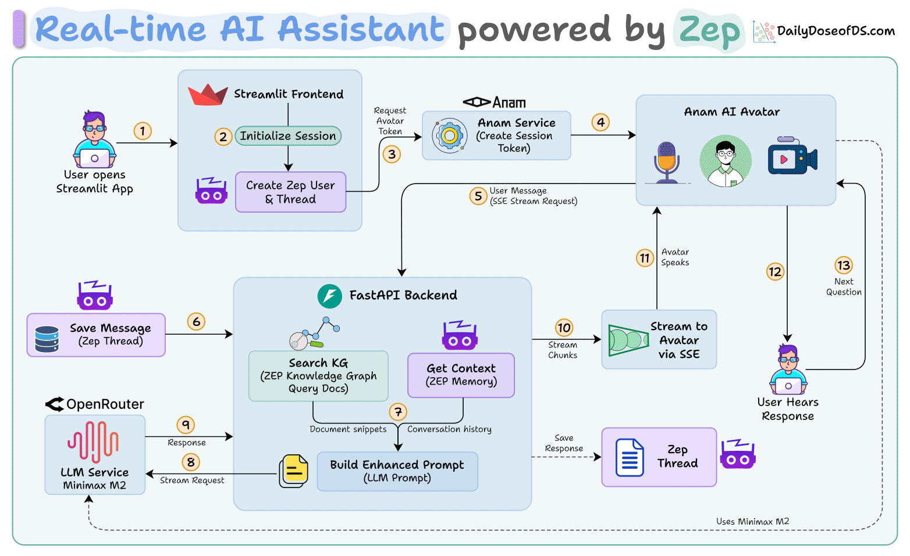

# AI Avatar Demo powered by Zep

A conversational AI assistant powered by [Zep](https://www.getzep.com/) knowledge graphs, custom LLM integration, and Anam AI avatar—creating natural conversations with memory and context-aware responses.

We use:

- [Zep](https://www.getzep.com/) for conversation memory and knowledge graph management
- Anam AI for realistic avatar and voice interactions
- OpenRouter with Minimax M2 (LLM)
- FastAPI for streaming backend
- Streamlit to wrap the logic in an interactive UI

## Architecture



## Set Up

Run these commands in project root

### Install Dependencies

```bash
uv sync
```

### Configure Environment

Create a `.env` file in the project root, similar to `.env.example`, and add your API keys:

[Get your Zep API keys here](https://www.getzep.com/)

### Ingest Data

To populate the knowledge graph with your data:

```bash
python scripts/ingest_to_graph.py
```

### Run the Application

Start the backend server:

```bash
uvicorn backend:app --port 8000 --reload
```

In a separate terminal, start the frontend:

```bash
streamlit run app.py
```

## Usage

1. Enter your session unique name in the sidebar
2. Click "Initialize New Session" to create a Zep session
3. Click "Start Conversation" to interact with the avatar
4. The assistant uses knowledge graph context and conversation history for personalized responses

Note: To understand Zep better, we recommend going through the Jupyter notebook (`zep_demo.ipynb`) provided in the project root.

## 📬 Stay Updated with Our Newsletter!

**Get a FREE Data Science eBook** 📖 with 150+ essential lessons in Data Science when you subscribe to our newsletter! Stay in the loop with the latest tutorials, insights, and exclusive resources. [Subscribe now!](https://join.dailydoseofds.com)

[](https://join.dailydoseofds.com)

## Contribution

Contributions are welcome! Feel free to fork this repository and submit pull requests with your improvements.
